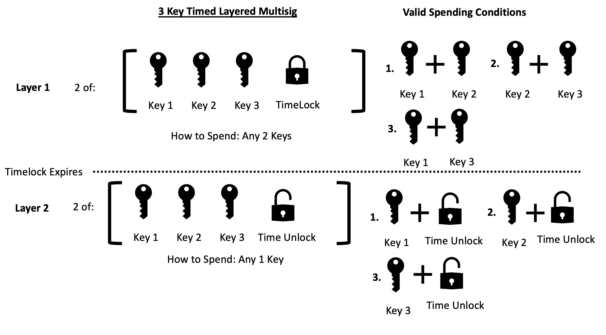

# mint-001

## 3 Key Degrading Multisig

## Motivation

- The 2-of-3 multisig serves as a standard in multisignature solutions,
offering a well-balanced combination of redundancy, security,
flexibility, and practicality for securing Bitcoin. Loss of a single key
does not spell disaster, and key distribution enhances security.
Miniscript's time feature enables further disaster recovery. If two
keys are lost, a timelock can convert the wallet to a 1-of-3 multisig.
The proposal outlines four conditions through Miniscript's `thresh()`:

    1. Key 1
    2. Key 2
    3. Key 3
    4. Timelock (either relative or absolute)

Initially, the wallet requires 2-of-3 keys, functioning as a traditional
2-of-3 multisig. After the timelock expires, only one key is needed to
spend the funds.

# Timelock Values Note

- Descriptor template security is independent of relative or absolute
timelock values; the impact is on timelock duration only. Reference
transactions on testnet use short-duration timelocks; however, practical
applications will vary.

- Relative timelock descriptors provide a
persistent structure, requiring a self-send to extend timelock security,
thus enabling standardized timelock durations.

- Absolute timelock
descriptors need frequent updates; setting long-term timelock values
becomes cumbersome. Updating these descriptors entails transferring
coins to a new descriptor with revised absolute timelock values.

- Suggested Relative Block Height Timelocks: older(32800) - Mid-point
block height relative timelock (\~278 days assuming constant hashrate)
older(65535) - Max duration block height relative timelock (\~455 days
assuming constant hashrate)

- Suggested Relative Epoch Timelocks: older(4224679) - Mid-point epoch
time relative timelock (\~180 days, 6 months) older(4259839) - Max
duration epoch time relative timelock (\~388 days)

##### Below is a reference diagram on how the 3 Key Time Layered Multisig operates across time:

## Example Miniscript Output Policies & Descriptors

### 3 Key Time Lock Multisig

### Relative Blockheight Timelock

<!---

I Suggest "species" as a means of referencing variations of policies with alternate implementations

--->

#### Species 1:

#### Policy:

<code>
thresh(2,pk(XPUB1),pk(XPUB2),pk(XPUB3),older(100))
</code>

#### Miniscript:

<code>
thresh(2,pk(XPUB1),s:pk(XPUB2),s:pk(XPUB3),sln:older(100))
</code>

#### Descriptor:

<code>
wsh(thresh(2,pk(XPUB1),s:pk(XPUB2),s:pk(XPUB3),sln:older(100)))
</code>

#### Script Structure:

<!--- <pre>Bitcoin Script</pre> --->

<!---
<pre>...</pre> is better for Bitcoin Script
--->

<!---

use &lt; for <
use &gt; for >

--->

<pre>&lt;XPUB1&gt; OP_CHECKSIG OP_SWAP &lt;XPUB2&gt; OP_CHECKSIG OP_ADD OP_SWAP &lt;XPUB3&gt;
OP_CHECKSIG OP_ADD OP_SWAP OP_IF
  0
OP_ELSE
  &lt;20ce25&gt; OP_CHECKSEQUENCEVERIFY OP_0NOTEQUAL
OP_ENDIF
OP_ADD 2 OP_EQUAL
</pre>

<pre>
<XPUB1> OP_CHECKSIG OP_SWAP <\XPUB2\> OP_CHECKSIG OP_ADD OP_SWAP <\XPUB3\>
OP_CHECKSIG OP_ADD OP_SWAP OP_IF
  0
OP_ELSE
  <20ce25> OP_CHECKSEQUENCEVERIFY OP_0NOTEQUAL
OP_ENDIF
OP_ADD 2 OP_EQUAL
</pre>

[Reference Testnet
Transaction](https://mempool.space/testnet/tx/13a204ec065f76878ee1f59f79b3eb2cea2b3fda4d8938e6cfa6a8394d090769)

#### Species 2: Cascading Timelocks (Relative Blockheight)

#### Policy:

<code>
thresh(2,and(older(100),pk(one)),and(older(200),pk(two)),and(older(300), pk(three)))
</code>

#### Miniscript:

<code>
thresh(2,j:and_v(v:pk(one),n:older(100)),sj:and_v(v:pk(two),n:older(200)),sj:and_v(v:pk(three),n:older(300)))
</code>

#### Descriptor:

<code>
wsh(thresh(2,j:and_v(v:pk(one),n:older(100)),sj:and_v(v:pk(two),n:older(200)),sj:and_v(v:pk(three),n:older(300))))
</code>

#### Script Structure:

<!--- <pre>Bitcoin Script</pre> --->
<!--- <pre>...</pre> is better for  --->

<pre>
OP_SIZE OP_0NOTEQUAL OP_IF
  <one> OP_CHECKSIGVERIFY <64> OP_CHECKSEQUENCEVERIFY OP_0NOTEQUAL
OP_ENDIF
OP_SWAP OP_SIZE OP_0NOTEQUAL OP_IF
  <two> OP_CHECKSIGVERIFY <c800> OP_CHECKSEQUENCEVERIFY OP_0NOTEQUAL
OP_ENDIF
OP_ADD OP_SWAP OP_SIZE OP_0NOTEQUAL OP_IF
  <three> OP_CHECKSIGVERIFY <2c01> OP_CHECKSEQUENCEVERIFY OP_0NOTEQUAL
OP_ENDIF
OP_ADD 2 OP_EQUAL
</pre>

<!--- TODO:
[Reference Testnet
Transaction](https://mempool.space/testnet/tx/TODO)
--->

### Absolute Blockheight Timelock

#### Species 1:

#### Policy:

<code>
thresh(2,pk(XPUB1),pk(XPUB2),pk(XPUB3),older(2477600))
</code>

#### Miniscript:

<code>
thresh(2,pk(XPUB1),s:pk(XPUB2),s:pk(XPUB3),sln:older(2477600))
</code>

#### Descriptor:

<code>
wsh(thresh(2,pk(XPUB1),s:pk(XPUB2),s:pk(XPUB3),sln:after(2477600)))
</code>

[Reference Testnet
Transaction](https://mempool.space/testnet/tx/df8a6946816a839f4de9d511ad902d740cc45ddddca3296de8fc11d1fd0c26f4)

#### Species 2: Cascading Timelocks (Absolute Blockheight)

#### Policy:

<code>
thresh(2,and(older(1050000),pk(one)),and(older(1050000),pk(two)),and(older(1050000), pk(three)))
</code>

#### Miniscript:

<code>
thresh(2,j:and_v(v:pk(one),n:older(1050000)),sj:and_v(v:pk(two),n:older(1050000)),sj:and_v(v:pk(three),n:older(1050000)))
</code>

#### Descriptor:

<code>
wsh(thresh(2,j:and_v(v:pk(one),n:older(1050000)),sj:and_v(v:pk(two),n:older(1050000)),sj:and_v(v:pk(three),n:older(1050000))))
</code>

#### Script Structure:

<!--- <pre>Bitcoin Script</pre> --->
<!--- <pre>...</pre> is better for  --->

<pre>
OP_SIZE OP_0NOTEQUAL OP_IF
  <one> OP_CHECKSIGVERIFY <900510> OP_CHECKSEQUENCEVERIFY OP_0NOTEQUAL
OP_ENDIF
OP_SWAP OP_SIZE OP_0NOTEQUAL OP_IF
  <two> OP_CHECKSIGVERIFY <900510> OP_CHECKSEQUENCEVERIFY OP_0NOTEQUAL
OP_ENDIF
OP_ADD OP_SWAP OP_SIZE OP_0NOTEQUAL OP_IF
  <three> OP_CHECKSIGVERIFY <900510> OP_CHECKSEQUENCEVERIFY OP_0NOTEQUAL
OP_ENDIF
OP_ADD 2 OP_EQUAL
</pre>

<!--- TODO:
[Reference Testnet
Transaction](https://mempool.space/testnet/tx/TODO)
--->

### Absolute Epochtime Timelock

#### Policy:

<code>
thresh(2,pk(XPUB1),pk(XPUB2),pk(XPUB3),after(1694563200))
</code>

#### Miniscript:

<code>
thresh(2,pk(XPUB1),s:pk(XPUB2),s:pk(XPUB3),sln:after(1694563200))
</code>

#### Descriptor:

<code>
wsh(thresh(2,pk(XPUB1),s:pk(XPUB2),s:pk(XPUB3),sln:after(1694563200)))
</code>

[Reference Testnet
Transaction](https://mempool.space/testnet/tx/c0b80a8103e6af92a9bf8e7fb1faa8d073dae929138a2c6d747404cb46e6d690)

### Relative Epochtime Timelock

#### Policy:

<code>
thresh(2,pk(XPUB1),pk(XPUB2),pk(XPUB3),older(4194400))
</code>

#### Miniscript:

<code>
thresh(2,pk(XPUB1),s:pk(XPUB2),s:pk(XPUB3),sln:older(4194400))
</code>

#### Descriptor:

<code>
wsh(thresh(2,pk(XPUB1),s:pk(XPUB2),s:pk(XPUB3),sln:older(4194400)))
</code>

[Reference Testnet
Transaction](https://mempool.space/testnet/tx/1a9ba5a5a37a0df72dfbc28f57de89ce35bda1819afa73712bc29caa32164687)

(Future Addition: Taproot-based keyset for Minitapscript once integrated
into Core)
